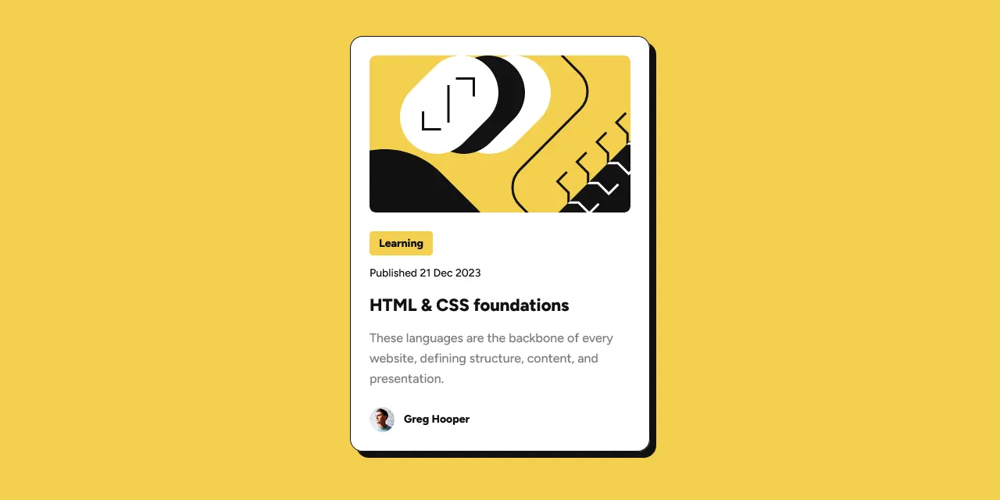

# Frontend Mentor - *Blog preview card* solution

This is my solution to the [Blog preview card challenge](https://www.frontendmentor.io/challenges/social-links-profile-UG32l9m6dQ) on Frontend Mentor.

## Table of contents

- [Overview](#overview)
  - [Screenshot](#screenshot)
  - [Links](#links)
- [My process](#my-process)
  - [Tools](#tools)
  - [Features](#features)
  - [What I Learned](#what-i-achieved)
- [Resources](#resources)

## Overview

### Screenshot



### Links

- Solution URL: <https://frontendmentor.io/solutions/blog-preview-card-Macf7lwl-s>
- Live Site URL: <https://erratic-enigma.github.io/blog-preview-card>

## My process

### Tools

- [Vite](https://vitejs.dev)
- [SCSS](https://sass-lang.com)

### Features

- Semantic HTML5 markup
- [RCCSS (Reasonable System for CSS)](https://rstacruz.github.io/rscss)
- CSS custom properties
- Flexbox
- CSS Grid

### What I achieved

#### Illustration crop

The `object-fit` property is useful for cropping images when outgrowing their context box. However, `object-fit` does not appear to work with the `svg` element. Instead, the `preserveAspectRatio` attribute, applied to the `svg` element, is used for a similar purpose.

This attribute is used on the illustration graphic to crop its size on small viewports:

```xml
  <svg preserveAspectRatio='xMidYMin slice'>…</svg>
```

#### Link wrap

Users can click / tap any part of the card to follow the link attached. Achieved by using a positioned `::before` pseudo-element on the child `a` element:

```scss
  .blog-preview {
    position: relative;
  }

  .link-wrap.-overlay::before {
    content: '';
    position: absolute;
    top: 0;
    right: 0;
    bottom: 0;
    left: 0;

    @supports(inset: 0) {
      inset: 0;
    }
  }
```

#### Card drop shadow

The drop shadow on the card reacts to users hovering, focusing or activating on the child `a` element. Achieved using the `:has()` pseudo-class:

```css
  .blog-preview:has(.link-wrap.-overlay:is(:focus, :hover, :active)) { … }
```

## Resources
- [A Look At preserveAspectRatio in SVG](https://jonitrythall.com/a-look-at-preserveaspectratio-in-svg)